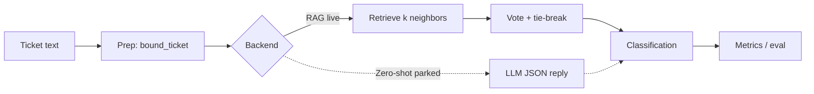

# Architecture

TickeTag classifies a support ticket into one category and returns a short
justification plus a confidence score. The live path is RAG. Zero-shot stays
in the repo as parked future work.

## Classification graph

The runtime graph is linear. `TicketClassificationPipeline` is the only
orchestrator: it prepares the ticket, calls one `TicketClassifier`, and
emits a result. There is no LangGraph / cyclic agent graph.

## Layers

| Concern | Where it lives | Role |
|---|---|---|
| **Prep** | `ticketag/text.py`, `ticketag/cli/rag_ingest.py`, `scripts/holdout_test_sample.py` | Cap/normalize ticket text, ingest labeled CSV rows into Chroma, carve a leakage-free holdout |
| **Graph** | `ticketag/pipeline.py`, `ticketag/protocols.py` | One shared DAG: bound → classify → result. Backends plug in via `TicketClassifier` |
| **RAG** | `ticketag/rag/` | Embed, query Chroma `tickets`, majority vote, high-confidence write-back |
| **Classification** | `ticketag/models.py`, `ticketag/taxonomy.py`, `ticketag/rag/classifier.py`, `ticketag/zeroshot/` | Result types, closed taxonomy for zero-shot, vote vs LLM decision |
| **Metrics** | `scripts/evaluate.py`, `notebooks/backend_evaluation.ipynb` | Accuracy, per-class P/R/F1, confusion matrices, confidence calibration |
| **Logging** | `ticketag/logging_setup.py` | One `configure_logging()` used by CLIs and the web UI; errors log context, not just the message |

## Entry points

- `ticketag-webui` — browser UI (RAG only; zero-shot control is visible but disabled)
- `ticketag-rag` / `ticketag-rag-ingest` — classify or load the `tickets` collection
- `ticketag-zeroshot` — parked CLI, still tested
